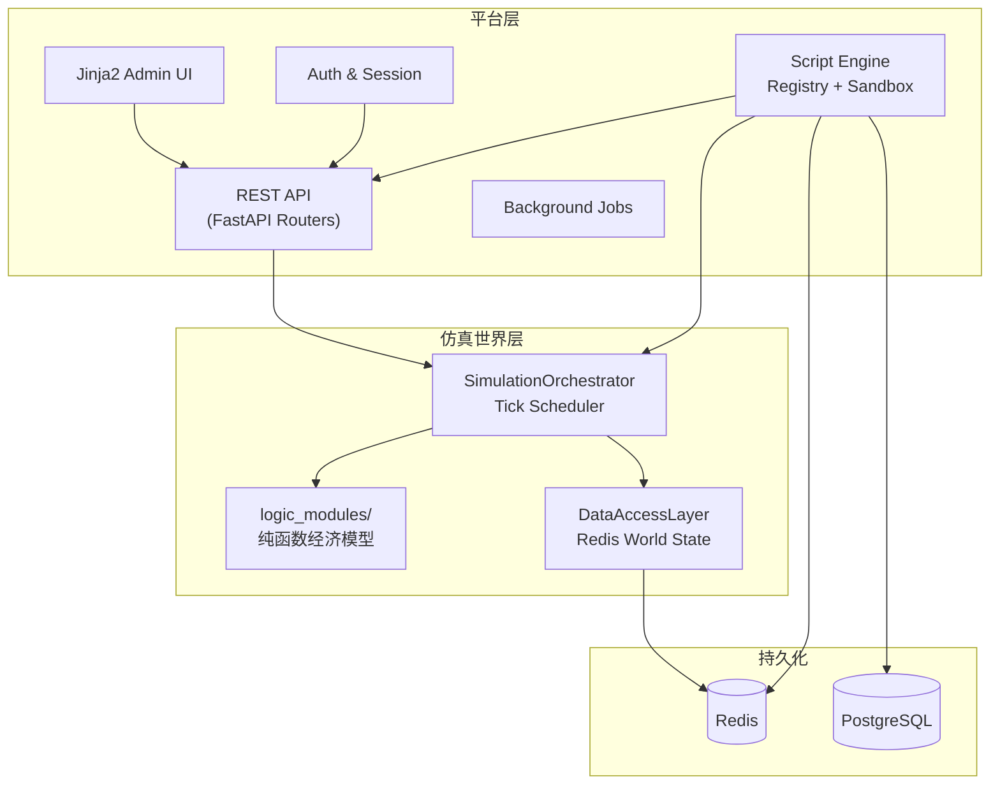
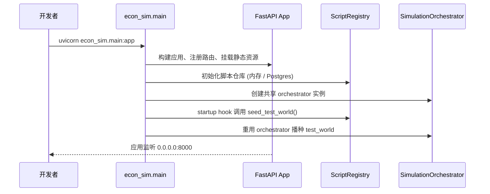
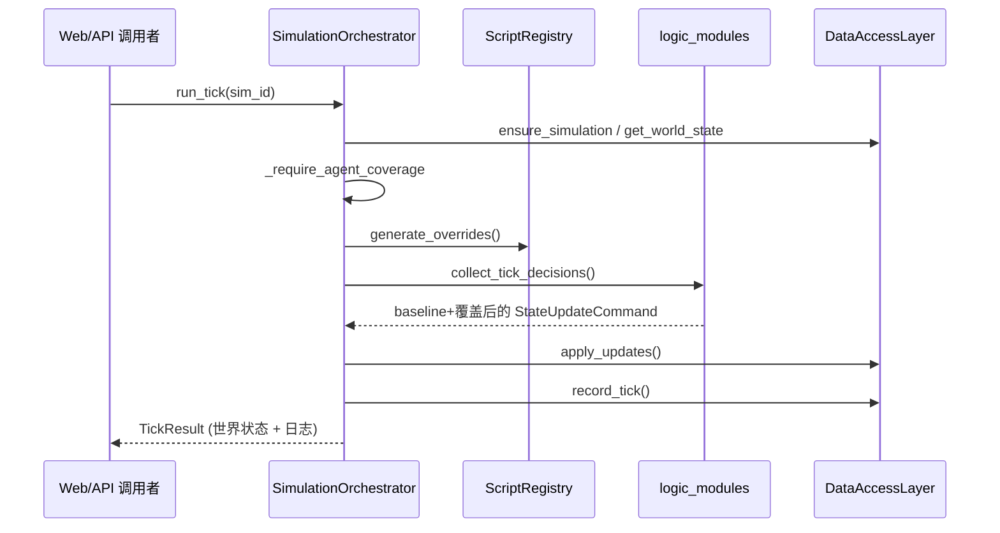

# 系统架构

本章解释 `econ.simulator` 的分层与模块职责，帮助你厘清“平台逻辑”与“仿真世界”如何解耦又协同。阅读顺序：先理解双层模型，再逐层拆解组件，最后查看关键调用链。

## 1. 双层模型总览



- **平台层**（Platform Layer）：围绕玩家/管理员操作展开，负责账户、会话、脚本生命周期、可视化、后台任务。模块之间通过 Python 接口直接调用或 REST API 交互。
- **仿真世界层**（Simulation Layer）：聚焦经济学模型。Tick 调度器协调市场逻辑、脚本覆盖、回写世界状态。世界层对外提供少量高阶方法（`run_tick`、`reset_simulation` 等）。
- **持久化层**：Redis 存放世界状态和短期数据；PostgreSQL 存放脚本源码、元数据、配额。平台层与仿真层通过数据访问层与脚本仓库共享同一存储，实现松耦合。

## 2. 模块拆分与角色

### 2.1 平台层模块

| 模块 | 位置 | 职责 | 关键接口 |
| ---- | ---- | ---- | -------- |
| API 网关 | `econ_sim/api/` | 定义 REST / JSON API；校验输入、调度 orchestrator、桥接脚本仓库 | `endpoints.py`、`auth_endpoints.py` |
| Web 仪表盘 | `econ_sim/web/` | 服务器渲染管理界面、会话管理、触发后台任务、展示世界快照 | `views.py`（依赖 `_orchestrator` 与 `script_registry`） |
| 认证与用户 | `econ_sim/auth/` | 注册、登录、会话存储、默认管理员播种 | `UserManager`、`SessionManager` |
| 脚本引擎 | `econ_sim/script_engine/` | 脚本存储、沙箱执行、限额、挂载/卸载、覆盖决策生成 | `ScriptRegistry`、`Sandbox`、`postgres_store.py` |
| 背景任务 | `econ_sim/web/background.py` | 基于 asyncio 的后台作业，如批量运行 Tick | `BackgroundJobManager` |

模块交互：
- Web/API 接口仅通过 `ScriptRegistry` 和 `SimulationOrchestrator` 访问仿真世界；不会直接触碰 Redis。
- 脚本相关 API 始终调用 `ScriptRegistry` 完成注册、挂载，随后 orchestrator 会调用 `_ensure_entity_seeded` 让世界状态与脚本保持同步。
- Web 仪表盘重用全局 `_orchestrator`，并在启动时由 `main.py` 自动播种 `test_world`，保证教学仿真随时可用。

### 2.2 仿真世界层模块

| 模块 | 位置 | 职责 | 要点 |
| ---- | ---- | ---- | ---- |
| 调度器 | `econ_sim/core/orchestrator.py` | Tick 管理、脚本覆盖、状态回写、日志记录、功能开关、守护策略 | `_require_agent_coverage` 强制五类主体具备脚本；`run_tick` 组合 fallback 与脚本输出 |
| 经济学逻辑 | `econ_sim/logic_modules/` | 纯函数实现市场出清、主体决策；输入世界状态与脚本决策，输出 `StateUpdateCommand` | `agent_logic.py`、`market_logic.py`、`shock_logic.py` |
| 世界状态模型 | `econ_sim/data_access/models.py` | 定义 `WorldState`、`TickResult` 等 Pydantic 模型，为平台层提供稳定契约 | 广泛用于 API、测试、文档 |
| 数据访问层 | `econ_sim/data_access/redis_client.py` | Redis 封装；提供仿真初始化、状态读写、参与者列表、日志管理 | `DataAccessLayer.ensure_simulation/get_world_state/apply_updates` |

仿真世界层对平台层暴露的接口集中在 `SimulationOrchestrator` 上：任何外部操作都通过 orchestrator 完成，这也是未来支持多种调度策略的挂载点。

### 2.3 组合方式

- 平台层组织脚本与用户；仿真层负责 Tick。脚本发动决策时，会通过 `ScriptRegistry.generate_overrides` 跑在沙箱里返回覆盖指令，再交给 `SimulationOrchestrator` 合并到 baseline fallback。
- `SimulationOrchestrator` 是双方的“桥梁”：既调用脚本仓库获取覆盖决策，又通过数据访问层写回 Redis 世界状态。
- 管理后台与 REST API 共享 orchestrator 和 registry 的全局实例，以便在同一个事件循环下复用连接池和缓存。

## 3. 代码结构导航

```
econ.simulator/
├── econ_sim/
│   ├── api/                # REST 路由、Pydantic Schema
│   ├── auth/               # 注册、登录、Session、播种
│   ├── core/               # SimulationOrchestrator 与批量工具
│   ├── data_access/        # Redis 封装、Pydantic 模型
│   ├── logic_modules/      # 经济学纯函数逻辑
│   ├── script_engine/      # ScriptRegistry、沙箱、Postgres Store
│   ├── strategies/         # 示例策略 & 基线逻辑
│   ├── utils/              # 配置、通用工具
│   └── web/                # Jinja2 模板、后台视图、后台作业
├── scripts/                # CLI 工具 & 运维脚本
├── tests/                  # Pytest 覆盖（按模块分类）
├── docs/                   # 经济设计 & 开发手册
└── config/                 # 环境配置、世界参数
```

## 4. 关键调用链

### 4.1 应用启动



要点：
- `ECON_SIM_SKIP_TEST_WORLD_SEED=1` 可以跳过播种；测试环境会自动跳过。
- 脚本仓库和 orchestrator 是单例，供 Web、API、脚本共享。

### 4.2 单 Tick 执行



Tick 内的脚本执行路径：`ScriptRegistry` → 沙箱跑 `generate_decisions` → 返回覆盖 → orchestrator 合并 baseline fallback。任何脚本失败会录入 `record_script_failures` 并通过 notifier 告警。

## 5. 技术选型与约束

| 领域 | 现用技术 | 说明 |
| ---- | -------- | ---- |
| Web 框架 | FastAPI + Uvicorn | 支持异步、类型提示、自动文档 |
| 状态存储 | Redis (`aioredis`) | Tick 间状态、日志、参与者；默认内存模式便于测试 |
| 脚本仓库 | PostgreSQL (`asyncpg`) | 脚本源码、版本、限额；无 DSN 时退化为内存 |
| 建模 | Pydantic v2 | 统一输入 / 输出模型，支撑 API 与逻辑层 |
| 并发 | asyncio | Tick 执行与脚本运行均在事件循环中完成 |
| 测试 | Pytest + pytest-asyncio | 单元 + 集成测试，覆盖脚本、仿真、Web |
| 容器 | Docker + docker-compose | 本地一键启动全栈服务 |

约束与原则：
- **模块解耦**：平台层不可直接触碰 Redis；仿真层依赖平台层时只能调用 `ScriptRegistry`（不反向依赖 API）。
- **纯函数逻辑**：`logic_modules/` 禁止外部副作用，便于单元测试与未来替换模型。
- **幂等播种**：所有播种脚本（如 `seed_test_world.py`）支持重复运行，确保教学环境随时可重置。

下一步建议阅读 [数据与持久化](./2_DATA_AND_STORAGE.md)，了解表结构与 Redis 键空间。
