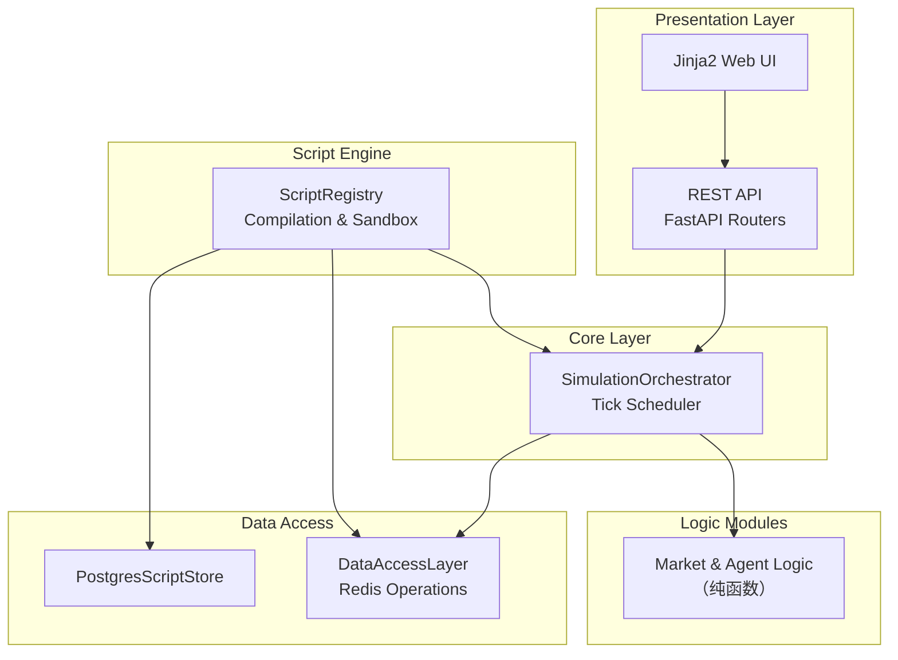
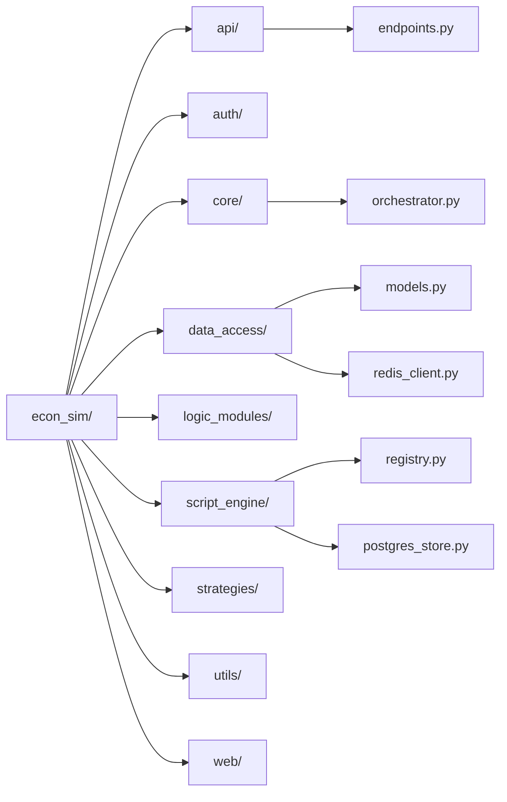
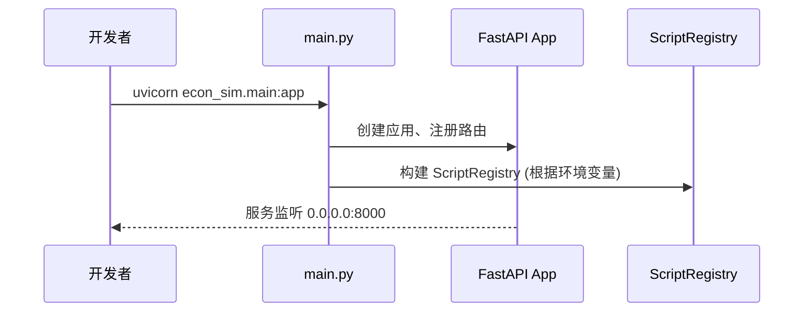
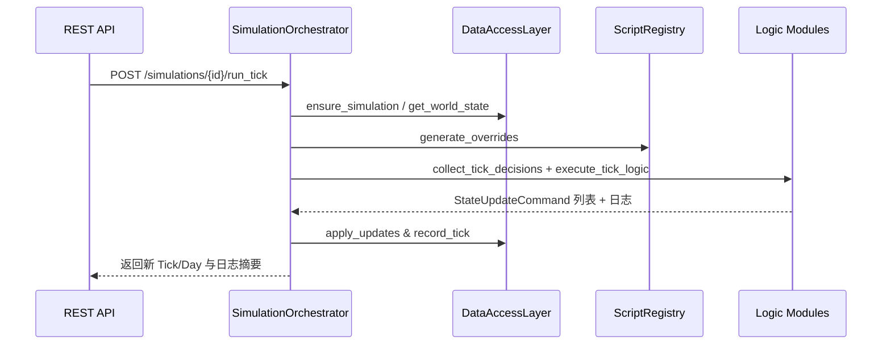

# 系统架构

本章梳理 `econ.simulator` 的整体架构、分层职责、执行流程与关键技术栈。

## 1. 顶层视图



- **Presentation 层**：`econ_sim/api/` 提供 REST 接口，`econ_sim/web/` 提供管理面板。
- **Core 层**：`SimulationOrchestrator` 组织 Tick 执行、合并策略并写回状态。
- **Logic Modules**：`econ_sim/logic_modules/` 以纯函数实现经济学计算。
- **Data Access**：`econ_sim/data_access/` 统一封装 Redis；`PostgresScriptStore` 负责脚本仓储。
- **Script Engine**：`econ_sim/script_engine/` 管理脚本上传、挂载与运行时执行。

## 2. 代码结构速览

### 2.1 项目根目录地图

```
econ.simulator/
├── config/                 # 仿真配置与环境变量
├── docs/                   # 项目文档（经济设计 + 开发手册）
├── econ_sim/               # Python 核心代码包
├── scripts/                # 启动、维护与分析脚本
├── tests/                  # Pytest 覆盖
├── docker-compose.yml      # 本地编排服务
├── requirements.txt        # 依赖定义
└── README.md
```

- `config/`：集中存放 `dev.env`、`world_settings.yaml` 等运行配置。
- `scripts/`：包含 `dev_start.sh`、`run_simulation.py` 等自动化脚本。
- `tests/`：按模块分层组织，覆盖脚本生命周期与仿真流程。

### 2.2 代码子包关系



- `api/`：REST 路由、权限校验、请求模型。
- `core/`：仿真编排与批量执行工具。
- `data_access/`：Redis/Postgres 封装与 Pydantic 模型。
- `script_engine/`：脚本仓库、沙箱执行与覆盖合并。
- `logic_modules/`：市场出清、代理行为等纯函数逻辑。
- `web/`：仪表盘与管理界面模板。

## 3. 核心流程

### 3.1 启动流程



- `main.py` 初始化 FastAPI、会话中间件与脚本仓库。
- 若配置了 `ECON_SIM_POSTGRES_DSN`，脚本仓库使用 Postgres 持久化。

### 3.2 单 Tick 执行



## 4. 技术选型

| 领域 | 技术/库 | 用途 |
| ---- | ------- | ---- |
| Web 框架 | FastAPI + Uvicorn | REST API 与 Web 界面 |
| 数据持久化 | Redis (aioredis)、PostgreSQL (asyncpg) | 仿真状态 / 脚本仓库 |
| 数据建模 | Pydantic v2 | 输入输出验证 |
| 任务调度 | asyncio | 异步 IO 与批量 Tick |
| 容器化 | Docker, docker-compose | 快速搭建开发环境 |
| 测试 | Pytest + pytest-asyncio | 单元与集成测试 |

阅读完本章后，建议继续查看 [数据与持久化](./2_DATA_AND_STORAGE.md)。
