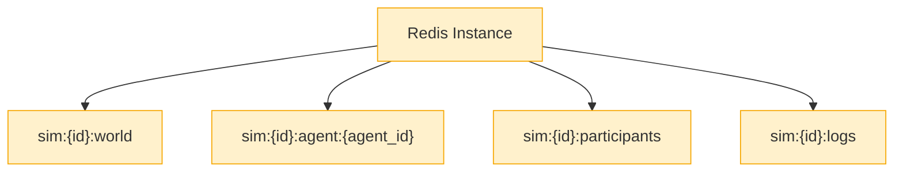
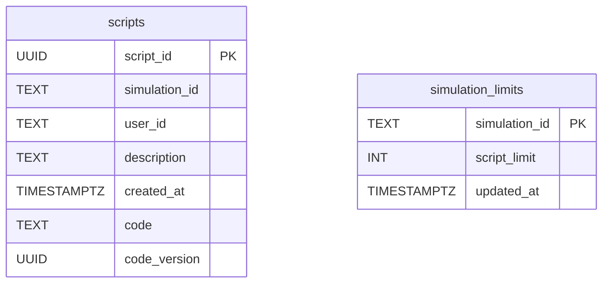
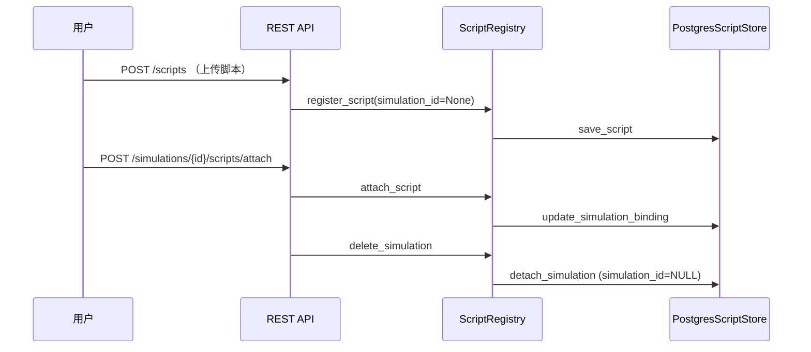

# 数据与持久化

本章聚焦运行时数据的来源、存储策略与操作流程，解释平台层与仿真世界在数据层的契约。你将看到：哪些数据放在 Redis、哪些落在 PostgreSQL、两者如何通过接口协同，以及未来演进方向。

## 1. 数据概览

| 数据域 | 存储介质 | 说明 |
| ------ | -------- | ---- |
| 仿真世界状态 (`WorldState`) | Redis | Tick/Day、宏观指标、主体资产负债表；高频读写，保持 JSON 化映射 |
| Tick 日志 / 参与者列表 | Redis | 统一由 `DataAccessLayer` 管理，Pipeline 保证写一致性 |
| 用户脚本源码 & 元数据 | PostgreSQL | 表 `scripts`，存储脚本代码、归属、挂载状态、版本号 |
| 脚本限额 & 仿真设置 | PostgreSQL | `simulation_limits`（在 `PostgresSimulationSettingsStore` 中维护） |
| 用户账号 / 会话 | 内存（默认）或 Redis | `UserManager`/`SessionManager` 可切换后端，默认内存够用 |

### 接口一览

| 接口提供者 | 关键方法 | 作用范围 |
| ------------ | -------- | -------- |
| `SimulationOrchestrator` | `create_simulation` / `get_state` / `run_tick` / `reset_simulation` | 对外暴露仿真世界读写能力 |
| `DataAccessLayer` | `ensure_simulation` / `get_world_state` / `apply_updates` / `record_tick` / `list_script_failures` | Redis 读写封装，仿真世界唯一入口 |
| `ScriptRegistry` | `register_script` / `attach_script` / `generate_overrides` / `list_scripts` | 脚本生命周期、沙箱执行、配额控制 |
| `UserManager` | `register_user` / `authenticate_user` / `list_users` | 账号创建、登录、后台播种 |

这些组件的输入输出均使用 Pydantic 模型（详见第 6 节），保证平台层与仿真层之间的契约稳定。

## 2. Redis 结构



- **键命名约定**：`sim:{simulation_id}:<scope>`。
  - `sim:{id}:world`：Tick、Day、宏观指标。
  - `sim:{id}:agent:{agent_id}`：代理人 Hash（资产负债、行为参数）。
  - `sim:{id}:participants`：Set，存储参与者邮箱。
  - `sim:{id}:logs`：List，按时间追加 Tick 日志。
- **访问方式**：统一通过 `DataAccessLayer` 方法：
  - `ensure_simulation()` 初始化或读取世界状态。
  - `get_world_state()`：组装 `WorldState` Pydantic 模型。
  - `apply_updates()`：接收 `StateUpdateCommand` 列表，批量执行 `HSET`/`HINCRBYFLOAT`。

## 3. PostgreSQL 脚本仓库

### 3.1 连接配置

- 关键环境变量：
  - `ECON_SIM_POSTGRES_DSN`
  - `ECON_SIM_POSTGRES_SCHEMA`
  - `ECON_SIM_POSTGRES_SCRIPT_TABLE`
  - `ECON_SIM_POSTGRES_MIN_POOL` / `MAX_POOL`
- 配置存在时，`ScriptRegistry` 将加载 `PostgresScriptStore`；否则退化为内存模式。

### 3.2 表结构



- `_ensure_schema` 在首次调用时完成建表和索引，并确保 `simulation_id` 允许为空。
- `code_version` 用于判定脚本是否需要重新编译；上传相同代码会沿用旧版本。
- `simulation_limits` 通过 `ScriptRegistry.set_simulation_limit` 维护，用于限制每位用户在某个仿真中的挂载数量。

### 3.3 生命周期交互



1. 上传脚本时 `simulation_id` 为 `NULL`，脚本进入个人仓库。
2. 挂载脚本会更新 `simulation_id`，脚本立即参与 Tick 决策。
3. 删除仿真只解绑脚本（`simulation_id` 置空），脚本仍可再次挂载。
4. 管理员或用户可调用删除接口彻底移除脚本（数据库记录与内存索引同步删除）。

### 3.4 基线脚本（Baseline Scripts）

- 目录 `deploy/baseline_scripts/` 存放五类主体的参考脚本，主要用于部署环境模拟真实用户接入。
- `scripts/seed_baseline_scripts.py` 会读取该目录并将脚本注册到 `ScriptRegistry`，可选挂载到指定仿真实例。
- Docker Compose 环境可运行 `docker compose run --rm app python scripts/seed_baseline_scripts.py --simulation demo-sim --attach --overwrite` 完成批量导入。

### 3.5 `test_world` 教学仿真种子 & 覆盖守护

- **自动化脚本**：`scripts/seed_test_world.py` 以协程 `econ_sim.script_engine.test_world_seed.seed_test_world` 为核心，默认播种 `test_world` 仿真；无论传入参数，家户脚本都会确保至少 400 份（与 4 个单体主体合计 404 条记录）。
- **典型用法**：

  ```bash
  python scripts/seed_test_world.py --simulation-id test_world --overwrite
  ```

  参数说明：
  - `--households <int>`：可调节目标家户数，但会自动向上取到 `max(400, num_households_in_settings)`；
  - `--overwrite`：清理目标用户名下的旧脚本后再写入，保证幂等；
  - `--simulation-id`：可播种到自定义仿真实例（教学沙盘/临时练习场景）。
- **实体命名约定**：家户脚本实体 ID 即数字字符串（`"000"`~`"399"`）；基线家户脚本为 `"900000"`，避免与教学种子冲突。
- **覆盖守护**：`SimulationOrchestrator._require_agent_coverage` 在每次 `run_tick` 前触发，校验五类主体既在世界状态出现、也挂载了脚本；对家户主体，还会逐个比对实体 ID → 若缺失将立即抛出 `MissingAgentScriptsError`，阻止带病前进。
- **运维建议**：
  1. 教学环境或集成测试可复用上述脚本播种；
  2. 运行 `pytest tests/test_seed.py::test_seed_test_world_can_execute_tick` 验证播种与首 Tick 行为；
  3. 若需重置仿真（`reset_simulation`）后继续运行，记得再次调用 `seed_test_world(..., overwrite=True)` 或在测试中执行 `_ensure_entities_from_scripts`，确保家户实体重新建档。

## 4. 世界状态结构细节

下表基于 `WorldState` Pydantic 定义，总结了 Redis 中同名 JSON 文档的主要字段，便于在调试时定位各主体的数据来源。

### 4.1 `world_state` 顶层字段

| 字段 | 类型 | 说明 |
| ---- | ---- | ---- |
| `simulation_id` | `str` | 仿真实例唯一标识，关联参与者与脚本记录 |
| `tick` | `int` | 当前 Tick 序号 |
| `day` | `int` | 当前天数（每日包含多个 Tick） |
| `households` | `Dict[int, HouseholdState]` | 家户主体集合，key 即家户 ID |
| `firm` | `FirmState` | 企业主体，默认 `firm_1` |
| `government` | `GovernmentState` | 政府主体，维护税率、支出等参数 |
| `bank` | `BankState` | 商业银行主体，含贷款、利率信息 |
| `central_bank` | `CentralBankState` | 央行政策参数 |
| `macro` | `MacroState` | GDP、通胀、失业率等聚合指标 |

### 4.2 家户与雇佣关系

| 字段 | 类型 | 说明 |
| ---- | ---- | ---- |
| `households[].balance_sheet.cash` | `float` | 现金余额 |
| `households[].balance_sheet.deposits` | `float` | 银行存款 |
| `households[].balance_sheet.loans` | `float` | 未偿还贷款 |
| `households[].employment_status` | `Enum` | 失业 / 企业雇佣 / 政府雇佣 |
| `households[].employer_id` | `Optional[str]` | 指向 `firm.id` 或 `government.id` |
| `firm.employees` / `government.employees` | `List[int]` | 反向引用家户 ID，用于工资结算 |

### 4.3 金融主体

| 主体 | 关键字段 | 描述 |
| ---- | -------- | ---- |
| `bank` | `deposit_rate`, `loan_rate`, `approved_loans` | 存贷利率、已批准贷款额度（以家户 ID 为键） |
| `central_bank` | `base_rate`, `reserve_ratio` | 货币政策工具，直接影响银行参数 |
| `macro` | `gdp`, `inflation`, `unemployment_rate` | 汇总各主体状态的统计量 |

需要深入了解字段含义或模型定义时，可参考 `econ_sim/data_access/models.py`。

## 5. 协作与账号存储

除世界状态外，系统还维护以下集合：

| 数据域 | 存储方式 | 说明 |
| ------ | -------- | ---- |
| 参与者列表 | Redis Set `sim:{id}:participants` | `SimulationOrchestrator.register_participant` 维护，供协作 UI 使用 |
| 用户账号 | `UserManager` 封装，默认内存；可切换 Redis Hash `econ_sim:users` | 包含邮箱、密码哈希、用户类型、创建时间；首次启动会自动播种管理员与五个基线账号（默认密码详见部署章节），可按需修改 |
| 登录会话 | `SessionManager` 内存字典；可扩展 Redis `econ_sim:sessions` 或 `SETEX` | 记录 token → email 映射，用于 Bearer 认证 |
| Tick 日志 | Redis List `sim:{id}:logs` | 存放 `TickLogEntry` 序列化结果，用于审计与前端展示 |

## 6. 数据模型（Pydantic）

- `econ_sim/data_access/models.py`
  - `WorldState`：仿真快照，包含 `macro`、`firm`、`households` 等子模型。
  - `StateUpdateCommand`：逻辑模块输出的更新指令，`DataAccessLayer.apply_updates` 解析执行。
  - `TickDecisionOverrides`：脚本或外部输入的决策覆盖。
- `ScriptRegistry` 与逻辑模块通过这些模型交流，保证类型安全与边界清晰。特别注意 `StateUpdateCommand.assign/delta` 语义：
  - `assign`：直接覆盖 Redis 中的字段（常用于元数据、Tick、Day 等标量）。
  - `delta`：对数值型字段做增量更新（例如现金余额）。

## 7. 事务与一致性

| 组件 | 策略 |
| ---- | ---- |
| Redis | 所有写操作走 Pipeline，`reset_simulation` 会重新初始化世界状态 |
| PostgreSQL | `asyncpg` 连接池自动提交；`register_script` / `attach_script` 在单协程内保持一致性；如需跨脚本更新请使用 `ScriptRegistry` 提供的方法 |

## 8. 常见排错

| 现象 | 可能原因 | 排查建议 |
| ---- | -------- | -------- |
| 上传脚本后未持久化 | 未配置 `ECON_SIM_POSTGRES_DSN`，退化为内存模式 | 检查环境变量或 Docker 服务状态 |
| 挂载脚本提示 404 | `script_id` 不存在或归属不一致 | 调用 `GET /scripts` 核对归属 |
| 仿真删除后脚本丢失 | 实际处于未挂载状态，需要重新挂载 | 在仪表盘或 API 列表查看 |
| Redis 数据重启丢失 | 使用内存 Redis | 改用 Docker compose 中的 Redis 服务 |

## 9. Redis + PostgreSQL 演进路线

随着脚本仓库已经迁移至 PostgreSQL，下一阶段可以按如下步骤扩展更多领域的持久化能力：

1. **统一状态接口**：在 `DataAccessLayer` 中抽象 Redis/PG `StateStore`，默认采用写穿策略（Redis 命中写入同时落地 PG）。
2. **Tick 日志归档**：将 `record_tick` 输出追加到 PostgreSQL 或对象存储，支持历史回溯与分析。
3. **策略版本管理**：为脚本增补“活跃版本 / 草稿版本”模型，支持日更策略时继承状态（见后续目标）。
4. **监控指标**：在 Prometheus 中暴露“主体覆盖率”“脚本失败率”等指标，与运维告警协同（详见 [5_DEPLOYMENT.md](./5_DEPLOYMENT.md)）。

完成本章后，可前往 [进度与待办](./3_PROGRESS_AND_TODO.md) 了解最新状态。
