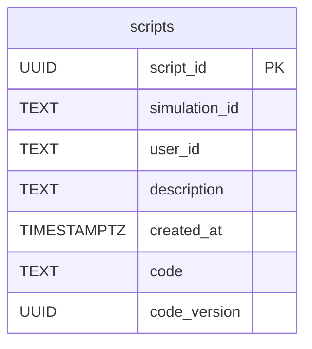
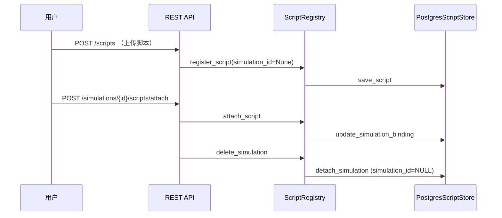

# 数据与持久化

本章聚焦运行时数据的来源、存储策略与操作流程，帮助你快速理解 Redis 与 PostgreSQL 的分工及其在代码中的映射。

## 1. 数据概览

| 数据域 | 存储介质 | 说明 |
| ------ | -------- | ---- |
| 仿真世界状态 (`WorldState`) | Redis | Tick/Day、宏观指标、代理人资产负债表，以 Hash / JSON 存储，支持快速读写 |
| Tick 日志 / 参与者列表 | Redis | 统一由 `DataAccessLayer` 管理，使用 Pipeline 保证一致性 |
| 用户上传脚本（源码 & 元数据） | PostgreSQL | 表 `scripts`，支持未挂载状态、历史版本号 |
| 会话与认证 | Redis + 内存 | `SessionMiddleware` + `auth/user_manager.py` 提供的令牌存储 |

## 2. Redis 结构

```mermaid
graph TD
    Redis[Redis Instance] --> World[sim:{id}:world]
    Redis --> Agent[sim:{id}:agent:{agent_id}]
    Redis --> Participants[sim:{id}:participants]
    Redis --> Logs[sim:{id}:logs]

    World:::node
    Agent:::node
    Participants:::node
    Logs:::node

    classDef node fill:#fff1cc,stroke:#f6a700,stroke-width:1px;
```

- **键命名约定**：`sim:{simulation_id}:<scope>`。
  - `sim:{id}:world`：Tick、Day、宏观指标。
  - `sim:{id}:agent:{agent_id}`：代理人 Hash（资产负债、行为参数）。
  - `sim:{id}:participants`：Set，存储参与者邮箱。
  - `sim:{id}:logs`：List，按时间追加 Tick 日志。
- **访问方式**：统一通过 `DataAccessLayer` 方法：
  - `ensure_simulation()` 初始化或读取世界状态。
  - `get_world_state()`：组装 `WorldState` Pydantic 模型。
  - `apply_updates()`：接收 `StateUpdateCommand` 列表，批量执行 `HSET`/`HINCRBYFLOAT`。

## 3. PostgreSQL 脚本仓库

### 3.1 连接配置

- 关键环境变量：
  - `ECON_SIM_POSTGRES_DSN`
  - `ECON_SIM_POSTGRES_SCHEMA`
  - `ECON_SIM_POSTGRES_SCRIPT_TABLE`
  - `ECON_SIM_POSTGRES_MIN_POOL` / `MAX_POOL`
- 配置存在时，`ScriptRegistry` 将加载 `PostgresScriptStore`；否则退化为内存模式。

### 3.2 表结构



- `_ensure_schema` 在首次调用时完成建表和索引，并确保 `simulation_id` 允许为空。
- `code_version` 用于判定脚本是否需要重新编译。

### 3.3 生命周期交互



1. 上传脚本时 `simulation_id` 为 `NULL`，脚本进入个人仓库。
2. 挂载脚本会更新 `simulation_id`，脚本立即参与 Tick 决策。
3. 删除仿真只解绑脚本（`simulation_id` 置空），脚本仍可再次挂载。
4. 管理员或用户可调用删除接口彻底移除脚本（数据库记录与内存索引同步删除）。

## 4. 数据模型（Pydantic）

- `econ_sim/data_access/models.py`
  - `WorldState`：仿真快照，包含 `macro`、`firm`、`households` 等子模型。
  - `StateUpdateCommand`：逻辑模块输出的更新指令，`DataAccessLayer.apply_updates` 解析执行。
  - `TickDecisionOverrides`：脚本或外部输入的决策覆盖。
- `ScriptRegistry` 与逻辑模块通过这些模型交流，保证类型安全与边界清晰。

## 5. 事务与一致性

| 组件 | 策略 |
| ---- | ---- |
| Redis | 所有写操作走 Pipeline，`reset_simulation` 会重新初始化世界状态 |
| PostgreSQL | `asyncpg` 连接池自动提交；单行更新保证 ACID；可按需扩展显式事务 |

## 6. 常见排错

| 现象 | 可能原因 | 排查建议 |
| ---- | -------- | -------- |
| 上传脚本后未持久化 | 未配置 `ECON_SIM_POSTGRES_DSN`，退化为内存模式 | 检查环境变量或 Docker 服务状态 |
| 挂载脚本提示 404 | `script_id` 不存在或归属不一致 | 调用 `GET /scripts` 核对归属 |
| 仿真删除后脚本丢失 | 实际处于未挂载状态，需要重新挂载 | 在仪表盘或 API 列表查看 |
| Redis 数据重启丢失 | 使用内存 Redis | 改用 Docker compose 中的 Redis 服务 |

完成本章后，可前往 [进度与待办](./3_PROGRESS_AND_TODO.md) 了解最新状态。
