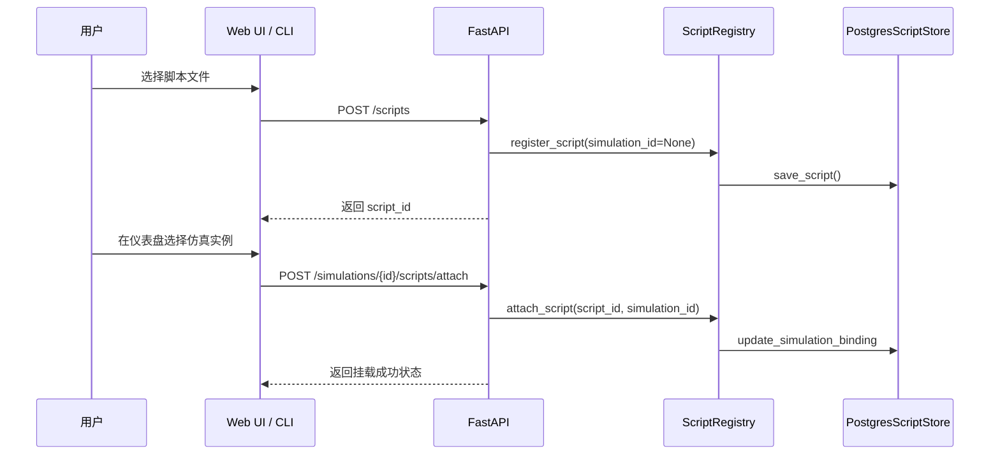

# API 参考

本章集中列出了对外暴露的 REST API，帮助你在开发 Web 前端、外部策略客户端或监控工具时快速查阅可用的端点及其契约。

## 1. 鉴权说明

- 默认采用 **Bearer Token**（`Authorization: Bearer <token>`）与会话 Cookie 双轨制；未登录请求会得到 `401`。
- 管理员端点需要 `is_admin=True` 的用户，若使用 CLI，请先通过 `/auth/login` 获取令牌。
- 所有接口返回 JSON，错误时遵循 FastAPI 标准格式：`{"detail": "..."}`。

## 2. 端点速览

### 2.1 认证 (`/auth`)

| 方法 | 路径 | 权限 | 描述 |
| ---- | ---- | ---- | ---- |
| `POST` | `/auth/register` | 公开 | 注册账号，返回基础资料 |
| `POST` | `/auth/login` | 公开 | 校验邮箱密码，返回 Bearer Token |

- **请求校验**：邮箱会被规范化为小写；密码长度 8~128。`user_type` 允许值：`individual`、`firm`、`government`、`commercial_bank`、`central_bank`。管理员账号仅能由运维预置。
- **默认管理员**：系统启动时自动确保 `admin@econ.sim` / `ChangeMe123!` 存在，登录后务必立即修改密码。

#### 注册示例

```json
POST /auth/register
{
    "email": "player@example.com",
    "password": "StrongPass123",
    "user_type": "individual"
}
```

```json
201 Created
{
    "user_id": "player@example.com",
    "user_type": "individual",
    "message": "Registration successful."
}
```

#### 登录示例

```json
POST /auth/login
{
    "email": "player@example.com",
    "password": "StrongPass123"
}
```

```json
200 OK
{
    "access_token": "0f8f8f4a0c2843e2a13d4f2f0d5a7df7",
    "token_type": "bearer"
}
```

常见错误：`401`（凭证错误）、`409`（邮箱已注册）、`400`（字段校验失败）。

### 2.2 仿真管理 (`/simulations`)

| 方法 | 路径 | 权限 | 描述 |
| ---- | ---- | ---- | ---- |
| `POST` | `/simulations` | 管理员 | 创建仿真实例，可选自定义 ID、配置文件 |
| `GET` | `/simulations/{id}` | 已登录 | 查询 Tick/Day 等运行状态 |
| `DELETE` | `/simulations/{id}` | 管理员 | 删除仿真实例并解绑脚本、参与者 |
| `POST` | `/simulations/{id}/run_tick` | 管理员 | 执行单个 Tick，可携带 `decisions` 覆盖 |
| `POST` | `/simulations/{id}/run_days` | 管理员 | 批量执行多日 Tick |
| `GET` | `/simulations/{id}/state/full` | 已登录 | 拉取完整 `WorldState`（调试用途） |
| `GET` | `/simulations/{id}/state/agents` | 已登录 | 查询家户状态，可通过 `ids` 参数筛选 |

`POST /simulations` 可选字段：`simulation_id`（缺省随机 UUID）、`config_path`（自定义场景）、`user_id`（预登记参与者）。

### 2.3 参与者协作

| 方法 | 路径 | 权限 | 描述 |
| ---- | ---- | ---- | ---- |
| `POST` | `/simulations/{id}/participants` | 已登录 | 将当前用户或指定 `user_id` 登记为参与者 |
| `GET` | `/simulations/{id}/participants` | 已登录 | 返回参与者邮箱列表 |

所有脚本相关接口会自动调用 `/participants` 登记上传者，前端也可以单独调用以展示在线协作者。

### 2.4 脚本与脚本库

| 方法 | 路径 | 权限 | 描述 |
| ---- | ---- | ---- | ---- |
| `POST` | `/scripts` | 已登录 | 上传脚本到个人库，进入“未挂载”状态 |
| `GET` | `/scripts` | 已登录 | 查看个人脚本（含未挂载），按用户隔离 |
| `POST` | `/simulations/{id}/scripts` | 已登录 | 上传脚本并立即挂载到仿真 |
| `GET` | `/simulations/{id}/scripts` | 已登录 | 列出仿真当前已挂载脚本 |
| `POST` | `/simulations/{id}/scripts/attach` | 已登录 | 将个人库脚本挂载到仿真 |
| `DELETE` | `/simulations/{id}/scripts/{script_id}` | 管理员 | 从仿真中删除脚本并解绑 |

所有脚本请求遵循 `ScriptUploadRequest` 结构：`code`（必填）、`description`（可选）、`user_id`（可省略，默认为当前登录邮箱）。上传成功会返回 `code_version` 用于客户端判断是否需重新编译。

### 2.5 运维与健康检查

| 方法 | 路径 | 权限 | 描述 |
| ---- | ---- | ---- | ---- |
| `GET` | `/health` | 公开 | 健康检查，返回 `{"status": "ok"}` |

> ✅ **冗余清理说明**：原 `docs/code_structure/3_API_DESIGN.md` 已合并至本章节，最新内容仅在 `docs/dev_handbook` 维护。

## 3. 脚本工作流时序



- 任意脚本上传后会获得 `script_id` 与 `code_version`，前者是后续操作的主键。
- 同一脚本支持重复挂载到不同仿真；解绑时数据库记录会保留以供复用。

## 4. 关键响应结构

| 端点 | 成功响应示例 |
| ---- | ------------ |
| `POST /scripts` | `{ "script_id": "uuid", "code_version": "uuid", "simulation_id": null, "message": "Script uploaded. Attach to a simulation when ready." }` |
| `GET /scripts` | `{ "scripts": [{ "script_id": "uuid", "simulation_id": "sim-123", "description": "Market Maker" }] }` |
| `POST /simulations/{id}/run_tick` | `{ "message": "Tick execution completed.", "new_tick": 16, "new_day": 5, "logs": ["Cleared market"], "macro": {"gdp": ...} }` |
| `POST /simulations` | `{ "simulation_id": "sim-123", "message": "Simulation created successfully.", "current_tick": 0, "current_day": 0 }` |

## 5. 开发调试指引

1. 在本地启动 `uvicorn econ_sim.main:app --reload` 后，访问 `http://localhost:8000/docs` 查看自动生成的 Swagger UI。
2. 若需要脚本上传示例，可参考 `tests/test_script_engine.py::test_attach_uploaded_script`。
3. 集成测试默认使用内存脚本仓库；设置 `ECON_SIM_POSTGRES_DSN` 后可验证真实的附件流程。

## 5. 常见错误码

| 状态码 | 典型场景 | 说明 |
| ------ | -------- | ---- |
| 400 | 请求体字段缺失、脚本语法错误、`run_days` 参数非法 | FastAPI/Pydantic 自动返回错误详情 |
| 401 | Authorization 头缺失或 token 失效 | `Invalid or expired access token` |
| 403 | 非管理员调用需要管理员权限的端点，或尝试替他人上传脚本 | `Admin privileges required` / `Cannot upload script for other users` |
| 404 | 仿真实例或脚本不存在 | 统一返回详细错误信息 |
| 409 | 邮箱重复注册 | `Email already registered` |
| 500 | 罕见的内部异常（如脚本执行异常未捕获） | 日志中会记录堆栈，需进一步排查 |

需要补充新的端点时，请同步更新此文件与 `docs/dev_handbook/0_OVERVIEW.md`，保持文档单一来源。