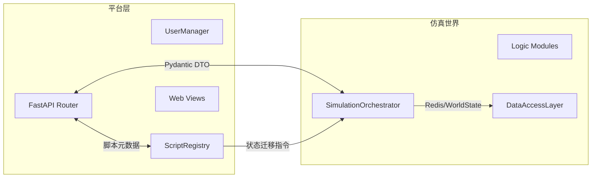

# API 参考

本章从“平台层 API ↔ 仿真世界接口”双视角梳理端点，帮助前端、脚本作者与运维人员快速掌握可用能力及其背后的 orchestrator/registry 协作方式。

## 1. 分层视角



- **平台层**：负责鉴权、接口校验、脚本生命周期与 Web 展示。
- **仿真世界**：通过 orchestrator 串联世界状态演化、市场逻辑与数据存取。
- 所有响应结构均由 Pydantic 模型定义，详见附录。

## 2. 鉴权

- Bearer Token（`Authorization: Bearer <token>`）是唯一有效的凭证格式；缺失或格式错误返回 `401`。
- 管理员能力（创建/删除仿真、批量推进、脚本删除、设置限制）需要 `user_type == "admin"`。
- 默认管理员账号在启动时播种：`admin@econ.sim` / `ChangeMe123!`。

### 2.1 认证端点

| 方法 | 路径 | 权限 | 调用链 |
| ---- | ---- | ---- | ---- |
| `POST` | `/auth/register` | 公开 | API → `UserManager.register_user`（PostgreSQL/内存） |
| `POST` | `/auth/login` | 公开 | API → `UserManager.authenticate_user` → 生成 token |

请求体字段：`email`、`password`、`user_type`。错误码：`400`（校验失败）、`409`（邮箱重复）、`401`（登录失败）。

## 3. 仿真管理端点

### 3.1 生命周期

| 方法 | 路径 | 权限 | Orchestrator 调用 |
| ---- | ---- | ---- | ----------------- |
| `POST` | `/simulations` | 管理员 | `create_simulation`（可选预注册参与者） |
| `GET` | `/simulations/{id}` | 已登录 | `get_state`（摘要） |
| `DELETE` | `/simulations/{id}` | 管理员 | `delete_simulation`（解绑脚本与参与者） |

创建时可传 `simulation_id`、`config_path`、`user_id`。若传 `user_id`，会自动调用 `register_participant`。

### 3.2 Tick 与 Day 推进

| 方法 | 路径 | 权限 | 功能 |
| ---- | ---- | ---- | ---- |
| `POST` | `/simulations/{id}/run_tick` | 管理员 | 单步推进，支持传入 `TickDecisionOverrides` 覆盖脚本决策 |
| `POST` | `/simulations/{id}/run_days` | 管理员 | 批量推进到未来 `days`，内部按 Tick 级循环 |

响应中会返回最新的 `tick`、`day`、`logs`、宏观指标。当前版本要求手动触发；每日批处理将在路线图中扩展（见 §7）。

### 3.3 世界状态读取

| 方法 | 路径 | 权限 | 说明 |
| ---- | ---- | ---- | ---- |
| `GET` | `/simulations/{id}/state/full` | 已登录 | 返回完整 `WorldState`（调试用途） |
| `GET` | `/simulations/{id}/state/agents?ids=1,2` | 已登录 | 返回指定家户的状态列表 |

### 3.4 参与者协作

| 方法 | 路径 | 权限 | Orchestrator 调用 |
| ---- | ---- | ---- | ----------------- |
| `POST` | `/simulations/{id}/participants` | 已登录 | `register_participant`（列表去重） |
| `GET` | `/simulations/{id}/participants` | 已登录 | `list_participants` |

脚本上传/挂载会自动登记参与者，无需额外调用。

### 3.5 仿真配置

| 方法 | 路径 | 权限 | 功能 |
| ---- | ---- | ---- | ---- |
| `PUT` | `/simulations/{id}/settings/script_limit` | 管理员 | 设置/移除每位用户脚本数量上限 |
| `GET` | `/simulations/{id}/settings/script_limit` | 管理员 | 查询当前脚本限额 |
| `PUT` | `/simulations/{id}/settings/features` | 管理员 | 调整外生冲击等功能开关 |
| `GET` | `/simulations/{id}/settings/features` | 管理员 | 查看当前功能开关参数 |

当仿真超过 tick 0 后，脚本限额和功能开关将拒绝修改（返回 `409`）。

## 4. 脚本生命周期端点

### 4.1 个人脚本库

| 方法 | 路径 | 权限 | 调用链 |
| ---- | ---- | ---- | ---- |
| `POST` | `/scripts` | 已登录 | API → `ScriptRegistry.register_script` → PostgreSQL |
| `GET` | `/scripts` | 已登录 | API → `ScriptRegistry.list_user_scripts` |

`ScriptUploadRequest` 字段：`code`、`description`（可选）、`agent_kind`、`entity_id`。返回 `script_id`、`code_version`。

### 4.2 仿真挂载

| 方法 | 路径 | 权限 | 调用链 |
| ---- | ---- | ---- | ---- |
| `POST` | `/simulations/{id}/scripts` | 已登录 | 上传并立即挂载，API → orchestrator → registry |
| `POST` | `/simulations/{id}/scripts/attach` | 已登录 | 从个人库挂载现有脚本 |
| `GET` | `/simulations/{id}/scripts` | 已登录 | 列出当前仿真脚本 |
| `DELETE` | `/simulations/{id}/scripts/{script_id}` | 管理员 | 卸载脚本（tick 0 前可操作） |

挂载/上传会触发 `register_participant`。若仿真已运行（tick > 0），API 会返回 `409` 并阻止修改。

## 5. 响应模型与错误约定

- **核心模型**：`SimulationCreateResponse`、`RunTickResponse`、`RunDaysResponse`、`ScriptUploadResponse`、`ScriptListResponse`。
- **错误格式**：FastAPI 默认 `{ "detail": "..." }`。主要错误码：
  - `400`：请求体校验失败、脚本语法错误、`run_days` 参数非法。
  - `401`：凭证缺失或无效。
  - `403`：非管理员访问敏感端点，或尝试代他人上传脚本。
  - `404`：仿真实例/脚本不存在。
  - `409`：缺少脚本触发 Tick、仿真锁定阶段禁止修改。

## 6. 调试与测试指引

1. 启动开发服务器：
   ```bash
   uvicorn econ_sim.main:app --reload --host 0.0.0.0 --port 8000
   ```
2. 打开 `http://localhost:8000/docs` 获取 Swagger 文档。
3. 参考测试：`tests/test_script_engine.py::test_attach_uploaded_script`、`tests/test_simulation.py::test_run_days_advances_world_state`。
4. 需要验证 PostgreSQL 流程时，设置 `ECON_SIM_POSTGRES_DSN`，或通过 Docker Compose 启动依赖（见第 5 章）。

## 7. 计划中的 API 拓展

### 7.1 每日 Tick 批处理入口

- 新增端点建议：`POST /simulations/{id}/schedule/day-run`
  - **请求**：`{"days": 1, "ticks_per_day": 96, "auto_rotate_scripts": true}`。
  - **调用链**：API → `SimulationOrchestrator.run_day_plan`（待实现）→ 任务调度器。
  - **日终钩子**：当 `auto_rotate_scripts` 为真，触发 `ScriptRegistry.rotate_scripts`，并允许家户上传的新脚本在下个 Day 生效。

### 7.2 脚本版本内省

- 计划扩展：`GET /scripts/{script_id}/versions`、`POST /scripts/{script_id}/rollback`。
- 依赖 `script_versions` 表（见数据章节路线图）。

### 7.3 状态/交易快照

- 计划端点：`GET /simulations/{id}/snapshot?day=N`，作为交易数据持久化后的查询入口。
- 响应将引用 PostgreSQL/对象存储中的归档。

> 🎯 以上设计与后续目标 1、2 对齐，实际上线前请更新本章的“端点速览”表格并附加示例。

## 8. 参考

- `econ_sim/api/endpoints.py`：端点实现与 Pydantic 模型定义。
- `econ_sim/auth/user_manager.py`：鉴权流程。
- `econ_sim/core/orchestrator.py`：仿真世界操作接口。
- `econ_sim/script_engine/registry.py`：脚本生命周期管理。
- `docs/dev_handbook/2_DATA_AND_STORAGE.md`：数据契约及模型演进路线。